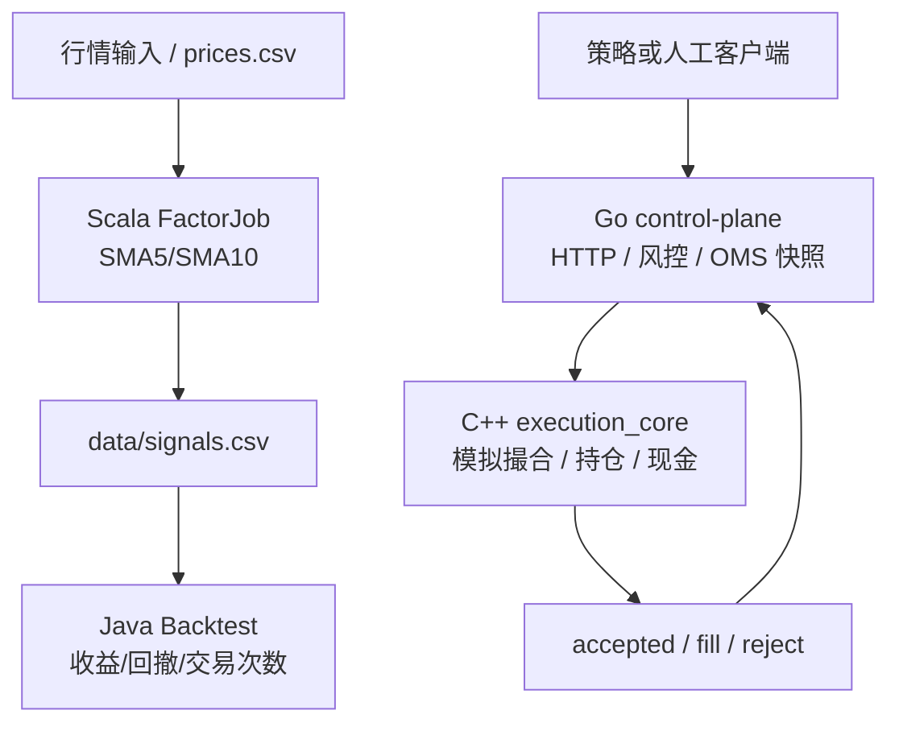

# 架构与边界

## 1. 总体结构



实时交易和研究回测是两条不同的路径：

- 实时路径追求边界清晰、依赖少、可观测和可恢复；
- 研究路径追求数据处理效率、实验可重复和批量迭代；
- Scala/Spark 不进入实时交易热路径；
- Java 回测结果不能直接视为实盘收益，必须加入交易成本、容量和成交约束后再评估。

## 2. 组件职责

### Go control-plane

入口：`go/control-plane/main.go`

负责：

- 暴露 `/health`、`/orders`、`/snapshot`；
- 生成缺省订单 ID；
- 校验标的、方向、数量、价格、名义金额和绝对仓位；
- 通过 stdin 向 C++ 子进程发送一行 JSON；
- 异步消费 C++ stdout 事件；
- 保存最近 100 个事件和内存状态。

当前限制：

- 进程重启后状态丢失；
- C++ 子进程退出后只记录日志，没有自动拉起和订单恢复；
- Go 代码中的风险值与 `config/system.json` 重复维护，尚未统一配置加载；
- `/orders` 返回“控制面接受”，不是交易所最终成交确认。

### C++ execution_core

入口：`cpp/execution_core/main.cpp`

负责：

- 从 stdin 读取 NDJSON；
- 解析 `order` 和 `query`；
- 对基础字段做二次校验；
- 按限价直接模拟成交；
- 更新内存持仓和现金；
- 输出 `accepted`、`fill`、`reject`、`snapshot` 事件。

当前限制：

- JSON 解析器是 MVP 级字段提取器，不是通用 JSON 解析器；
- 没有订单簿、撮合优先级、部分成交、撤单和成交回报序列号；
- `symbol` 和订单 ID 没有 JSON 转义处理；
- 退出时不落盘。

### Scala FactorJob

入口：`scala/factor/src/main/scala/FactorJob.scala`

负责：

- 读取 `date,symbol,close` CSV；
- 计算当前窗口的 SMA5 和 SMA10；
- long window 未满 10 个样本时输出 0；
- SMA5 大于 SMA10 输出 1，否则输出 -1；
- 生成 `date,symbol,signal,score` CSV。

当前实现是单机批任务，未来可将读取和窗口计算替换为 Spark DataFrame/SQL + Parquet。

### Java Backtest

入口：`java/backtest/src/Backtest.java`

负责：

- 读取价格和信号 CSV；
- 在 T 日读取信号；
- 使用 T+1 收盘价计算收益；
- 输出总收益、最大回撤和交易次数。

当前限制：

- 当前示例只适合单标的、按日期索引的简单数据；
- 没有手续费、滑点、持仓市值、资金占用和容量模型；
- 没有 walk-forward、样本外和压力测试；
- 结果是工程验收基线，不是投资结论。

## 3. 进程和协议边界

当前运行时拓扑：

```text
Go process
  ├── HTTP server: 127.0.0.1:8080
  └── child process: C++ execution_core
        ├── stdin: order/query NDJSON
        └── stdout: accepted/fill/reject/snapshot NDJSON
```

研究任务独立运行：

```text
Scala JVM process -> data/signals.csv -> Java JVM process
```

`proto/events.proto` 是目标协议定义，不代表当前已经生成或使用 Protobuf 代码。迁移时需要同时设计：

- schema 版本；
- 向后兼容和未知字段策略；
- `sequence`、`event_id`、`order_id`、`account_id`；
- 交易所时间、接收时间、处理时间；
- 重放和幂等语义。

## 4. 关键设计判断

1. **Go 做控制面，C++ 做执行核心**：Go 便于 HTTP、配置和运维；C++ 保留低延迟数据结构和未来柜台 SDK 适配空间。
2. **Scala 只做批量研究**：Spark 的优势是批量数据计算，不应该侵入逐订单热路径。
3. **Java 做回测服务**：适合承载实验任务、指标计算、配置和元数据；不要将回测的理想成交模型直接当作实盘模型。
4. **先本地管道、后网络协议**：当前 stdin/stdout 便于验证边界；生产部署时改为专用 IPC、共享内存或消息总线，并保留事件重放能力。
